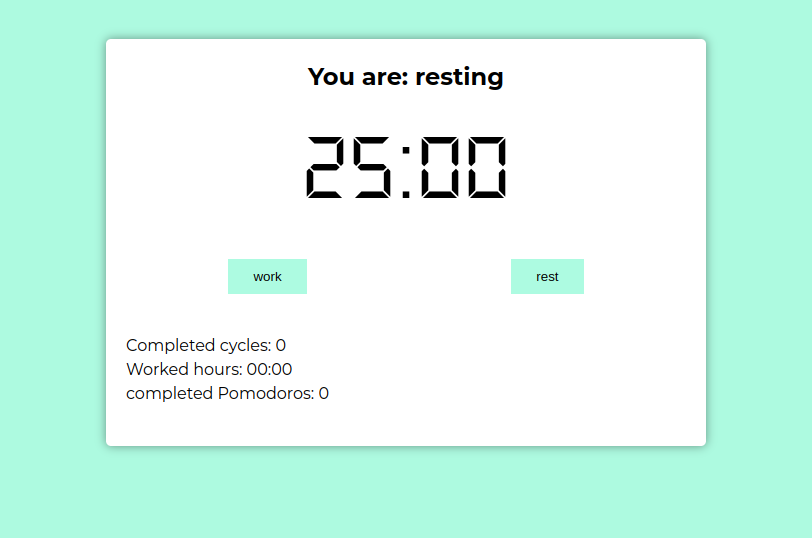
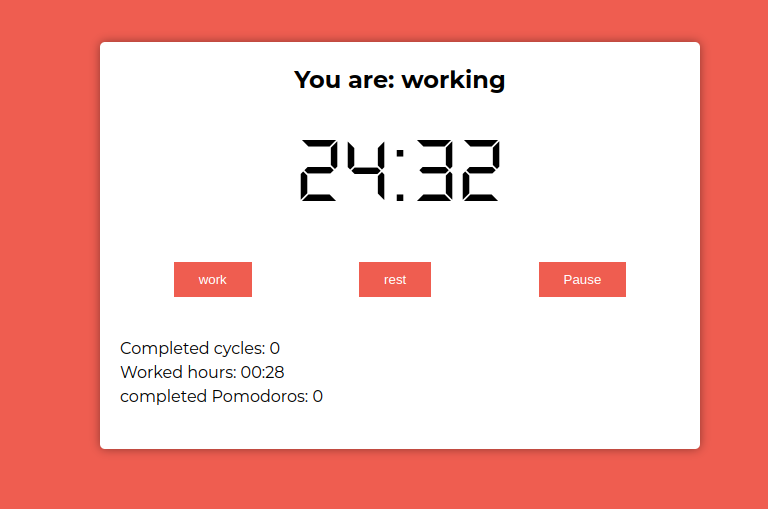
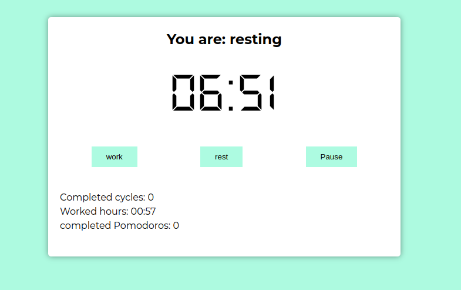

# Pomodoro App
🍅 A Técnica Pomodoro é um método de gerenciamento de tempo desenvolvido por Francesco Cirillo no final dos anos 1980. A técnica consiste na utilização de um cronômetro para dividir o trabalho em períodos de 25 minutos, separados por breves intervalos.

## Inicie o timer, para que a aplicação comece a rodar



## O tempo começara a correr, enquanto isso foque na sua atividade. Não se preoucupe, você ouvirá um som ao final do tempo. 



## Faça uma pequena pausa antes de voltar ao foco.




```bash
# Clone este repositório
$ git clone git@github.com:PedroFonseca13/pomodoro-ts.git

# Acesse a pasta do projeto no terminal/cmd
$ cd pomodoro-ts

# Instale as dependências da api
$ npm install

# Execute a aplicação em modo de desenvolvimento
$ npm start

# O servidor inciará na porta:3000 - acesse <http://localhost:3000> 
```
